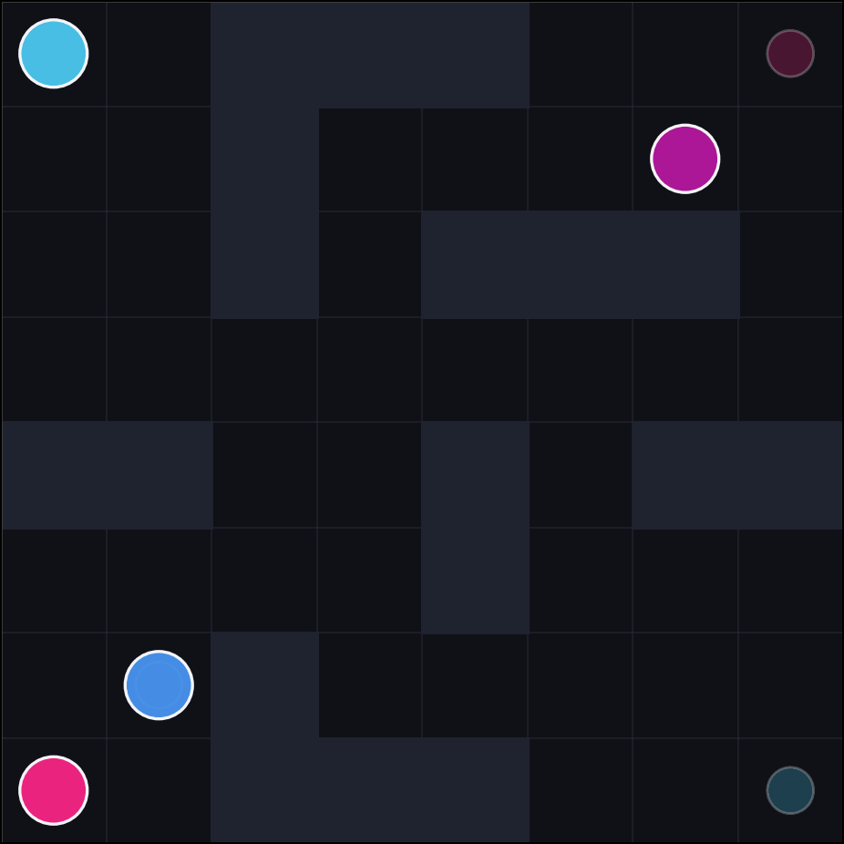

# Multi-Agent Path Finding

This project addresses the Multi-Agent Path Finding (MAPF) problem, which involves planning collision-free paths for multiple agents navigating a shared environment from their respective start positions to goal locations.

## Types of Conflicts

A solution is valid only if no agents collide while executing their paths. The following conflict types are considered:

- **Vertex Conflict**: Occurs when two or more agents occupy the same grid cell at the same time step.
- **Edge Conflict**: Occurs when two agents swap positions in the same time step.

## Installation

### 1. Clone the Repository

```bash
git clone https://github.com/sshivensolanki/multi-agent-path-finding.git
cd multi-agent-path-finding
```

### 2. Install Dependencies

```bash
pip install -r requirements.txt
```

## Run Experiments

### Run on a Randomly Generated Map

```bash
python run_experiment.py --random --solver CBS --disjoint
```

### Run on a Predefined Instance File

```bash
python run_experiment.py --instance "instances/warehouse_01.txt" --solver CBS --disjoint
```

<br>

<p align="center">
  
</p>